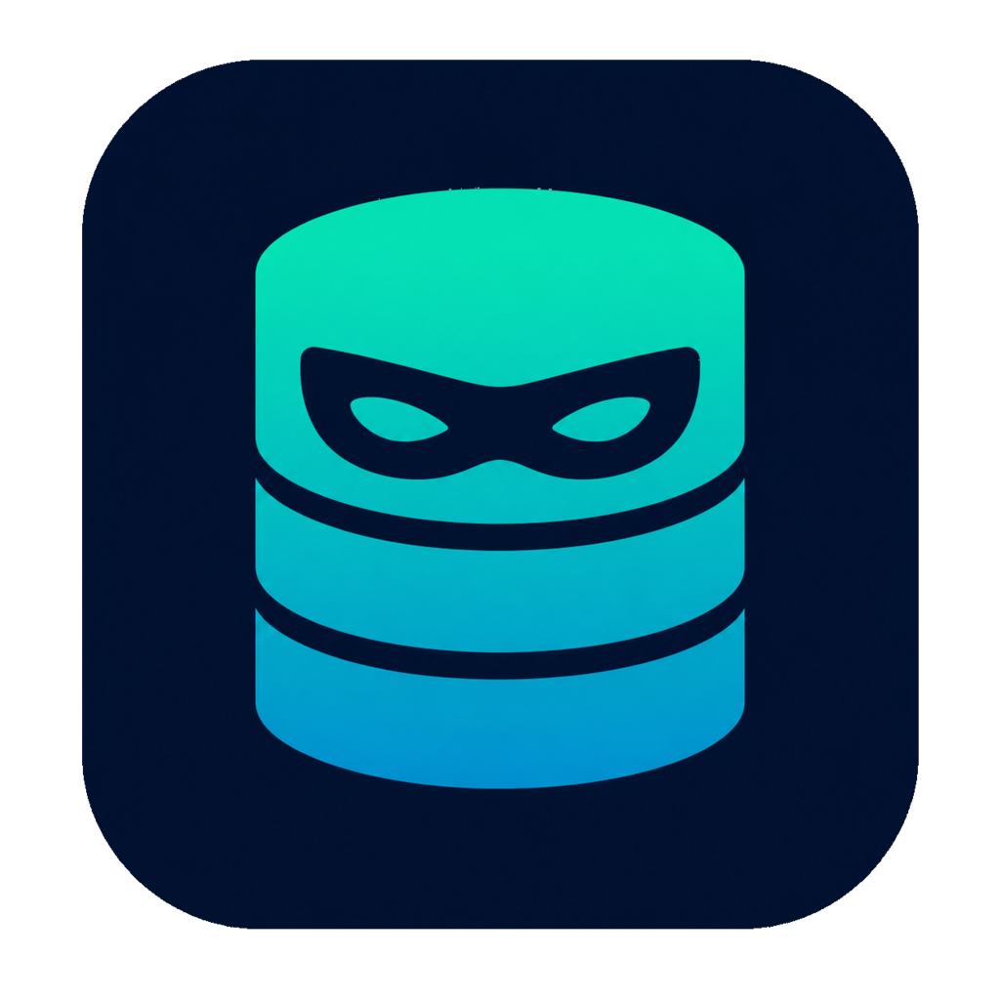

<p align="center">
  
</p>

# DBcooper

A database client for PostgreSQL, SQLite, Redis, and ClickHouse, built with Tauri, React, and TypeScript.


## Installation

### Homebrew (recommended)

```bash
brew install --cask --force amalshaji/taps/dbcooper
```

Homebrew clears the Gatekeeper quarantine automatically, so the app opens right away.

### Direct download

Download the latest `.dmg` from [Releases](https://github.com/amalshaji/dbcooper/releases).

**macOS users:** After installing (**before opening the app the first time**), bypass Gatekeeper since the app isn't notarized:
```bash
xattr -cr /Applications/DBcooper.app
```
Then you can open the app normally.

## Features

Check out the full list of features on our [documentation site](https://dbcooper.amal.sh/#features).

### Docker databases

From the Connections screen, DBcooper can:

- Create PostgreSQL 17, Redis 7, or ClickHouse 25.8 in a Docker container and save a ready-to-use connection.
- Link a compatible PostgreSQL, Redis, or ClickHouse container that already exists in the current Docker context, including Docker Compose services.
- Copy the complete connection string for a Docker-managed connection.
- Stop and restart the linked container from the connection menu.

Databases created by DBcooper use a persistent named volume. Quitting DBcooper
stops the container without removing the container or its data, and opening the
connection starts it again. Deleting a connection also preserves Docker data
unless you explicitly choose to remove it.

Linking an existing container requires its database port to be published to the
host. DBcooper reads standard image environment variables, including Docker
secret-style `*_FILE` values, and lets you review the detected connection fields
before saving.

## FAQ

Find answers to common questions on our [documentation site](https://dbcooper.amal.sh/#faq).

## Tech Stack

- **Frontend**: React + TypeScript + Vite
- **Backend**: Rust + Tauri v2
- **Database**: SQLite (local storage) + PostgreSQL, Redis, and ClickHouse connections
- **UI**: shadcn/ui components
- **Package Manager**: Bun

## Development

### Prerequisites

- [Bun](https://bun.sh/) - JavaScript runtime and package manager
- [Rust](https://www.rust-lang.org/) - For Tauri backend
- macOS 26 (Tahoe) or later

### Setup

```bash
# Install dependencies
bun install

# Run in development mode
bun run tauri dev

# After changing icon.png or src-tauri/macos/AppIcon.png
# regenerate every platform icon and the macOS asset catalog
bun run icons

# Build for production
bun run tauri build
```

### AI SQL Generation

To use AI-powered SQL generation:

1. Go to **Settings** (gear icon) and choose an AI provider:
   - **OpenAI-compatible API**: configure an API key, endpoint, and model.
   - **Claude Code**, **Codex CLI**, or **opencode**: DBcooper uses your local CLI install and existing login.

2. In the **Query Editor**, you'll see an instruction input above the SQL editor:
   - Type a natural language description (e.g., "show all users with posts from last week")
   - Click **Generate** or press Enter
   - Review the generated SQL before running it

The AI receives your instruction, existing editor SQL, and selected table/column schema metadata for accurate query generation.

## Building

The app is configured to build for macOS ARM (Apple Silicon). The build process:

1. Creates optimized production bundles
2. Signs the app with your signing key
3. Generates updater artifacts

## Releases

Releases are automated via GitHub Actions. To publish a new version:

1. Update `version` in `src-tauri/tauri.conf.json`
2. Open a PR and add the `release` label
3. Merge the PR into `main`
4. GitHub Actions will create and push the tag (e.g., `v0.0.42`), then build a draft release
5. Review and publish the release

### Canary releases

Every commit merged into `main` publishes a signed canary after the test suite
passes. Canary versions use the next patch version with a build suffix, such as
`v0.0.64-canary.142`.

Canary updates are disabled by default. To receive them, open Settings and enable
**Canary updates**. Disable the setting to return to the stable channel; if the
installed canary is newer than the latest stable release, DBcooper will wait for
the next newer stable release instead of downgrading.

### Required Secrets

Set these in your GitHub repository settings:

- `TAURI_SIGNING_PRIVATE_KEY` - Contents of your signing key file
- `TAURI_SIGNING_PRIVATE_KEY_PASSWORD` - Password (if set)

## License

MIT
