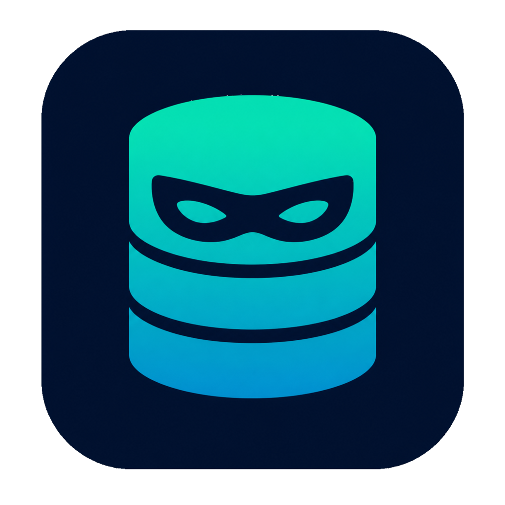

<p align="center">
  
</p>

# DBcooper

A database client for PostgreSQL, MySQL, MariaDB, SQLite, DuckDB, Redis, ClickHouse, and Cloudflare D1, built with Tauri, React, and TypeScript.


## Installation

### Homebrew (recommended)

```bash
brew install --cask --force amalshaji/taps/dbcooper
```

### Direct download

Download the latest `.dmg` from [Releases](https://github.com/amalshaji/dbcooper/releases).

Stable macOS releases are signed and notarized by Apple, so they can be installed
and opened normally without bypassing Gatekeeper.

## Features

Check out the full list of features on our [documentation site](https://dbcooper.amal.sh/#features).

### Docker databases

From the Connections screen, DBcooper can:

- Create PostgreSQL 17, MySQL 8.4, MariaDB 11.4, Redis 7, or ClickHouse 25.8 in a Docker container and save a ready-to-use connection.
- Link a compatible PostgreSQL, MySQL, MariaDB, Redis, or ClickHouse container that already exists in the current Docker context, including Docker Compose services.
- Copy the complete connection string for a Docker-managed connection.
- Stop and restart the linked container from the connection menu.

Databases created by DBcooper use a persistent named volume. Quitting DBcooper
stops the container without removing the container or its data, and opening the
connection starts it again. Deleting a connection also preserves Docker data
unless you explicitly choose to remove it.

Linking an existing container requires its database port to be published to the
host. DBcooper reads standard image environment variables, including Docker
secret-style `*_FILE` values, and lets you review the detected connection fields
before saving.

## FAQ

Find answers to common questions on our [documentation site](https://dbcooper.amal.sh/#faq).

## Tech Stack

- **Frontend**: React + TypeScript + Vite
- **Backend**: Rust + Tauri v2
- **Database**: SQLite app storage; PostgreSQL, MySQL, MariaDB, SQLite, DuckDB, Redis, ClickHouse, and Cloudflare D1 connections
- **UI**: shadcn/ui components
- **Package Manager**: Bun

## Development

### Prerequisites

- [Bun](https://bun.sh/) - JavaScript runtime and package manager
- [Rust](https://www.rust-lang.org/) - For Tauri backend
- macOS 26 (Tahoe) or later

### Setup

```bash
# Install dependencies
bun install

# Run in development mode
bun run tauri dev

# After changing icon.png or src-tauri/macos/AppIcon.png
# regenerate every platform icon and the macOS asset catalog
bun run icons

# Build for production
bun run tauri build

# Test D1 against a disposable local Wrangler database
bun run test:d1-local
```

### MCP server for external agents

DBcooper includes an opt-in, token-authenticated MCP server for external coding agents. See [docs/mcp.md](./docs/mcp.md) for setup and curl examples.

### Cloudflare D1

To create a D1 connection:

1. Open the Cloudflare dashboard **Account home**, find the account, open its menu, and choose **Copy account ID**. See Cloudflare's [Account ID guide](https://developers.cloudflare.com/fundamentals/account/find-account-and-zone-ids/).
2. Go to **My Profile → API Tokens → Create Token → Create Custom Token**. Under permissions, choose **Account → D1 → Read** for browsing and querying, or **Edit** if DBcooper should edit rows or create tables. Scope the token to the account from step 1. See Cloudflare's [API token guide](https://developers.cloudflare.com/fundamentals/api/get-started/create-token/).
3. Create the token and copy its secret immediately. Cloudflare shows the secret only once, so store it securely.
4. In **New Connection**, choose **Cloudflare D1**, enter the Account ID and token, select **Load databases**, then choose a database from the list.

The in-app connection form links to the same [Cloudflare D1 setup guide](https://dbcooper.amal.sh/#cloudflare-d1-setup).

D1 connections use Cloudflare's HTTPS API directly and do not support SSH tunnels. Cloudflare applies a global API limit of 1,200 requests per five minutes per user; DBcooper surfaces rate-limit responses and does not automatically replay D1 requests. Because the API transports results as JSON, integers outside JavaScript's safe integer range may lose precision when displayed.

### AI SQL Generation

To use AI-powered SQL generation:

1. Go to **Settings** (gear icon) and choose an AI provider:
   - **OpenAI-compatible API**: configure an API key, endpoint, and model.
   - **Claude Code**, **Codex CLI**, or **opencode**: DBcooper uses your local CLI install and existing login.

2. In the **Query Editor**, you'll see an instruction input above the SQL editor:
   - Type a natural language description (e.g., "show all users with posts from last week")
   - Click **Generate** or press Enter
   - Review the generated SQL before running it

The AI receives your instruction, existing editor SQL, and selected table/column schema metadata for accurate query generation.

## Building

The app is configured to build for macOS ARM (Apple Silicon). The build process:

1. Creates optimized production bundles
2. Signs the app with a Developer ID certificate and submits it to Apple for notarization
3. Staples the notarization ticket to the app bundle
4. Generates signed updater artifacts

## Releases

Releases are automated via GitHub Actions. To publish a new version:

1. Update `version` in `src-tauri/tauri.conf.json`
2. Prepare the release notes in `RELEASE_NOTES.md`
3. Open a focused PR, add the `release` label, and wait for all checks to pass
4. Merge the PR into `main`
5. Confirm GitHub Actions created the version tag at the release merge commit and built a draft release
6. Replace the draft's generic body with `RELEASE_NOTES.md`
7. Validate the DMG, updater archive, signature, and `latest.json`, then smoke-test installation and the in-app update from the previous stable version on a clean supported Mac
8. Publish the draft and verify the Homebrew cask update and a fresh installation or upgrade

### Canary releases

Every commit merged into `main` publishes a signed canary after the test suite
passes. Canary versions use the next patch version with a build suffix, such as
`v0.0.64-canary.142`.

Canary updates are disabled by default. To receive them, open Settings and enable
**Canary updates**. Disable the setting to return to the stable channel; if the
installed canary is newer than the latest stable release, DBcooper will wait for
the next newer stable release instead of downgrading.

### Required Secrets

Set these in your GitHub repository settings:

- `APPLE_CERTIFICATE` - Base64-encoded Developer ID Application certificate (`.p12`)
- `APPLE_CERTIFICATE_PASSWORD` - Password for the certificate archive
- `APPLE_ID` - Apple ID used to submit the app for notarization
- `APPLE_PASSWORD` - App-specific password for the Apple ID
- `APPLE_TEAM_ID` - Apple Developer team identifier
- `TAURI_SIGNING_PRIVATE_KEY` - Contents of the Tauri updater signing key file
- `TAURI_SIGNING_PRIVATE_KEY_PASSWORD` - Password for the updater signing key

## License

MIT
